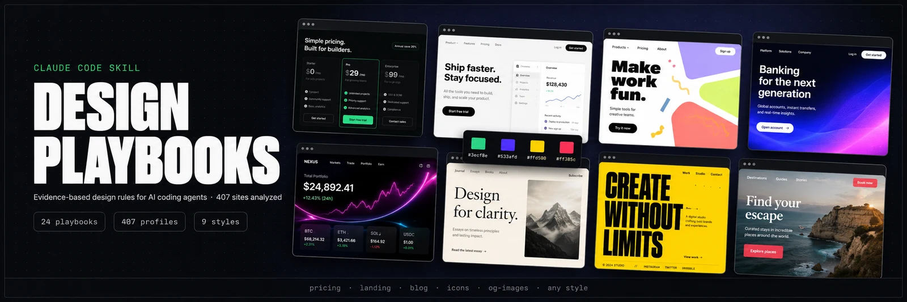

# Design Playbooks for Claude Code

[](https://claude.com/claude-code)
[](#whats-inside)
[](#the-playbooks)
[](LICENSE)
[](#extending)

**Evidence-based design rules for AI coding agents — synthesized from 407 real product sites, not from vibes.**

AI-generated frontends all look the same: purple gradient, Inter, three cards. Principles-only skills tell the model *what to avoid*; this skill shows it *what actually works* — page-by-page playbooks with pattern frequencies, 407 site profiles with sampled hex palettes and type stacks, and a routing skill that loads exactly the evidence a task needs.

## Highlights

- **11 page playbooks** — how real sites build `pricing` (123 examples), `home` (315), `blog`, `product`, `about`… Anatomy with % frequencies, patterns that work (every claim cites a site), anti-patterns, build checklist.
- **9 style playbooks** — minimal-light, dark-tech, dark-neon, colorful-playful, illustration, big-type, elegant-serif, photo-driven, gradient-mesh. Palette formulas with real hex, typography formulas, Do/Don't.
- **407 site profiles** — per-site YAML tokens (canvas/ink/primary/accents, type families, radius) + layout, components, signature moves. Vision-generated from screenshots, calibrated against authoritative ground truth (9/9 pass).
- **Domain layer** — 248 cataloged design works (motion, branding, print, 3D), 93 app icons, 49 OG images, each with craft-rules playbooks.
- **Structured search** — `find.py --style DT --category fintech --tone dark --on-disk pricing`. 14 normalized categories, light/dark tone, page filters, keyword/tag search, `--like <brand>`, graceful auto-loosening. No more guessing grep strings.
- **Token previews** — `scripts/preview.py <slug>` renders visual swatches + type-scale + a component card from any profile's tokens, **no screenshots needed**.
- **DESIGN.md generator** — "make a DESIGN.md like Linear, but green" → tokenized design system for *your* project, in the Google-Stitch-compatible 9-section format (works in awesome-design-md tooling too).
- **Live Analyzer** — profile any live URL on the fly; the corpus is a July-2026 snapshot, not a ceiling.
- **Auto-triggering** — the skill activates on any frontend/UI task and enforces one rule above all: *take tokens from ONE reference, never average palettes.*

## Install

```bash
git clone https://github.com/veryCoolTimo/design-playbooks-skill.git ~/.claude/design-library
ln -s ~/.claude/design-library/skill ~/.claude/skills/design-playbooks
```

Restart Claude Code. The skill triggers automatically on frontend work, or ask explicitly: *"show me references for a dark fintech landing"*.

**Optional — screenshot layer (~900 MB).** Playbooks and profiles work standalone; screenshots let the agent look at real pixels:

```bash
python3 ~/.claude/design-library/scripts/fetch_media.py --all
```

## Usage

| You say | The skill does |
|---|---|
| "Build a pricing page for a dev-tools product, dark" | `find.py --style DT --category developer-tools --on-disk pricing` → reads `pricing.md` + `dark-tech.md`, picks 2–3 profiles, applies one palette (e.g. Supabase `#3ecf8e` on `#121212`) |
| "Fix the hero on our landing" | Reads your tailwind/CSS first, infers your style code, picks *matching* references — doesn't fight your design |
| "Make a DESIGN.md like Linear" | Generates a tokenized design system for your brand from the `linear.app` profile |
| "Design an app icon" | Loads the app-icons playbook + 93-icon catalog, shows 3 references |
| "What do good OG images look like?" | og-images playbook: contrast at 1200×630, text floors, brand block placement |

## The playbooks

| Layer | Files | Contents |
|---|---|---|
| `playbooks/pages/` | 11 | home, pricing, blog, product, about, resources, solutions, company, features, use-cases, misc |
| `playbooks/styles/` | 9 | one per style code (ML/DT/DN/CP/IL/BT/EL/PH/GR) |
| `playbooks/domains/` | 4 | websites, design-work, app-icons, og-images |
| `profiles/sites/` | 407 | per-site tokens + analysis |
| `profiles/` | 3 | design.md (248 works), icons.md (93), og.md (49) |

Every playbook carries a coverage badge (`> Coverage: 123 examples from corpus`) — you always know how much evidence backs a rule.

## How it works

```
task ("pricing page, dark, dev-tools")
  │
  ├─ 1. classify: page=pricing · style=DT · industry=dev-tools
  ├─ 2. rules:    playbooks/pages/pricing.md + playbooks/styles/dark-tech.md
  ├─ 3. evidence: grep catalog.json → 2-4 profiles → read tokens
  ├─ 4. pixels:   view 2-3 screenshots (if media layer installed)
  └─ 5. build:    structure from page playbook · tokens from ONE profile · mood from style playbook
```

The knowledge was produced by a calibrated multi-agent vision pipeline: profile prompts were tuned against authoritative DESIGN.md ground truth until palette/typography/radius matched (9/9 first round), then ~140 vision agents swept the full corpus. Synthesis agents distilled page and style playbooks from the profiles.

## vs. alternatives

| | This skill | Mobbin MCP | frontend-design (official) |
|---|---|---|---|
| Synthesized rules | ✅ playbooks with % frequencies | ❌ raw screens | ⚠️ principles, no evidence |
| Real tokens (hex/type) | ✅ 407 profiles | ❌ | ❌ |
| Price | free, local, offline | paid plans | free |
| Corpus size | 407 sites + 390 works | 600k+ screens | — |

Use it *with* the official frontend-design skill: that one sets aesthetic direction, this one supplies the evidence.

## Project structure

```
design-library/
├── skill/SKILL.md        # the routing skill (symlink target)
├── catalog.json          # v2 index: style(+alt), category(+sub), tone, palette, tags, keywords
├── playbooks/            # pages/ · styles/ · domains/
├── profiles/             # sites/*.md · design.md · icons.md · og.md
├── scripts/              # find · taxonomy · build_catalog · validate_library · fetch_media · update_recent
├── media/                # optional screenshot layer (gitignored, fetched on demand)
└── docs/                 # spec + implementation plan
```

## Extending

- **New sites:** `python3 scripts/update_recent.py` pulls fresh items; profile them with `scripts/profile-prompt.md`.
- **New page types:** ≥15 examples in the corpus → own playbook; otherwise extend `misc.md`.
- **Integrity:** `python3 scripts/validate_library.py` must stay at 0 errors — CI-friendly.
- PRs with new profiles/playbooks welcome; keep the schema (`scripts/profile-prompt.md`) and cite evidence.

## Fair use

Profiles and playbooks are original analysis of publicly observable design patterns; no proprietary assets ship with this repo. Screenshots are fetched by the end user from public CDNs for local reference only. Not affiliated with or endorsed by any referenced brand.

## License

MIT
